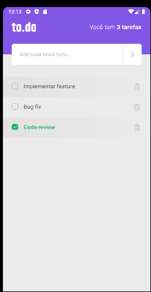

<h1 align="center">
{ MySkills }
</h1>

 

  

## 🚀 Tecnologias

Esse projeto foi desenvolvido utilizando:

- ReactNative
- TypeScript
- StyleSheet

## 💻 Projeto

Desafio do bootcamp Ignite da Rocktseat na qual foi necessário colocar em prática os aprendizados do primeiro módulo de introdução ao React Native.
